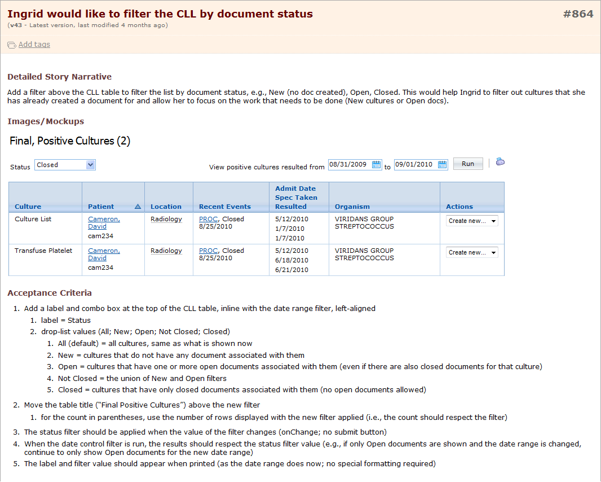
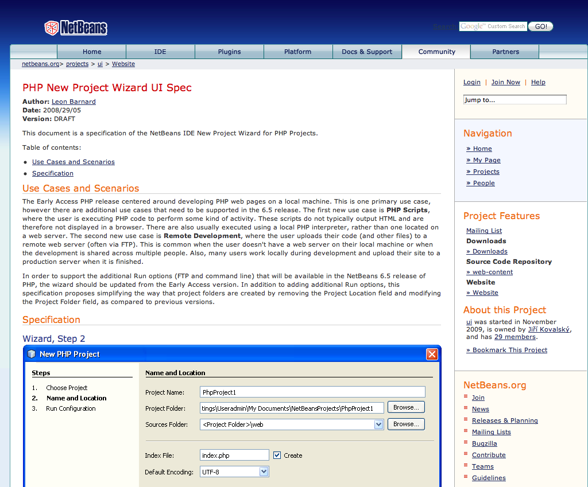
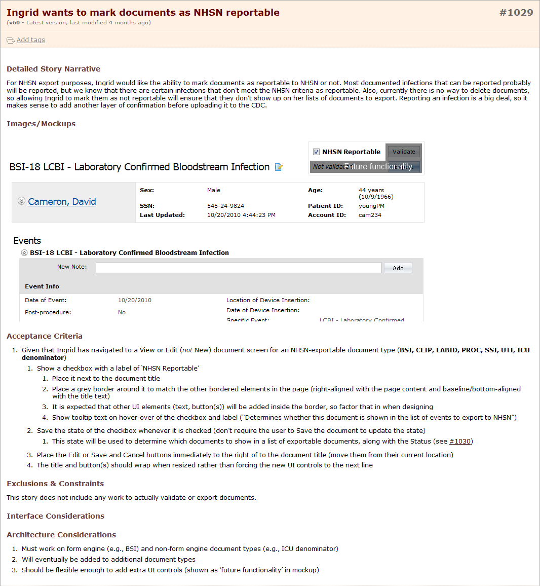
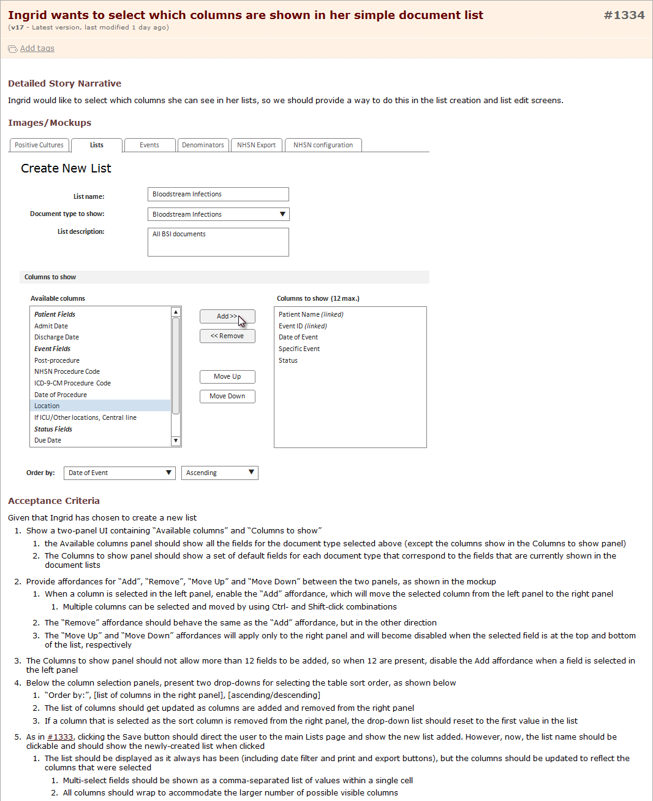
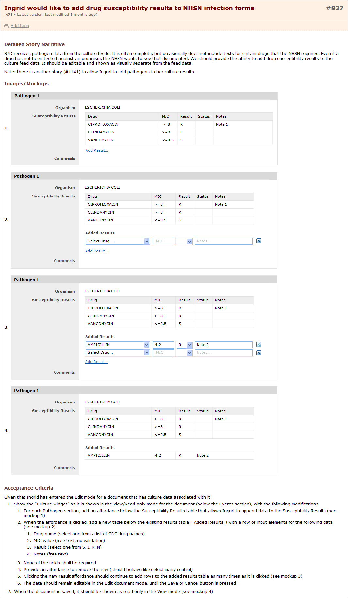

In 2 separate roles I researched and wrote design specifications for new features. In each case I delivered the UI design and provided detailed acceptance criteria for how those features should behave.

This information gave the development team the detail they needed to do the work, and provided the QA team with the information they needed to test that it did what it was supposed to do.

