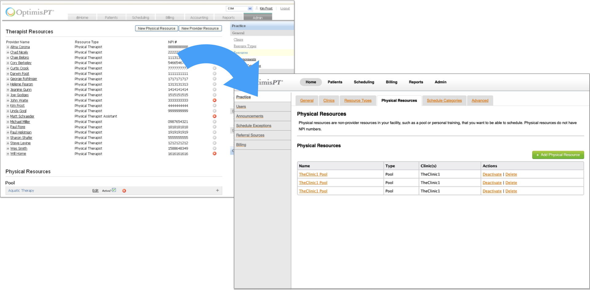

**Customer:** A SaaS-based startup that owned and created software for physical therapy clinics.

**Who I worked with:** Director of Operations (SME), Software Trainer (SME), Product Manager, 3 Developers.

**Responsibilities:** Qualitative Research, UX and UI Design, Content Design, Front-end Development, Project Management

---



## The Problem
*   The company wanted to reach customers **outside of the clinics they owned**.
*   Trial users complained about the **setup and configuration process** (the screens within the Admin tab).
*   This area of the product was highlighted as a **key barrier** to new customer sales.






---

## Timeline

The project went through **4 distinct phases** over the course of a few months.

**Note:** The PM left the company shortly after the problem was prioritized, leaving me in the role of product and project manager, in addition to being a UX team of one. Fortunately, I had access to 2 SMEs who knew the problem and product well.

---

## Phase 1: Research and Discovery

I spoke to both subject matter experts—the software trainer and the Director of Operations—via in-person meetings over several days to understand the users, their needs, and barriers to success.



After these conversations **3 categories of usability problems** stood out:

1. **Poor UX for frequent tasks**
1. **Confusing terminology**
1. **Complex billing rules and procedures**






### Research artifacts

I started by creating artifacts to try to record and visualize what I’d learned and wrap my head around the problem.

One activity that helped was a reality map I made of the configuration and setup training process, which included pain points and possible solutions.

---

## Early Solution Hypotheses

After a few weeks of research I came up with 4 areas to focus on to best address the problems as I understood them.

1\. **Improving the Information Architecture and navigation** would improve overall usability and reduce frustration.

2\. **Applying basic content and UX design principles** would improve overall usability and improve satisfaction.

3\. **Adding inline help and descriptive text** would reduce time spent reading documentation and decrease support load.

4\. **Using a modern front-end web framework** would increase consistency and usability of forms, and speed up implementation.

---

## Phase 2: Low Fidelity Design

I explored possible solutions in low fidelity to test my hypotheses.

### Hypothesis 1: _Improving the Information Architecture and navigation would improve overall usability and reduce frustration_

First I tried to think of alternate groupings of screens that would be more intuitive for the users. I went through several iterations of this.

Here is a card sort with new IA ideas next to the old navigation.

I then began translating those IA ideas into UI navigation concepts. I feel that it’s important to explore as much as possible during the early phases.

 

### Hypothesis 2: _Applying basic content and UX design principles would improve overall usability and improve satisfaction_

Once the the IA started coming together, I moved on to content and UX design within the screens.

For starters, I cleaned up the tables and moved buttons to a more standard location. I changed the vague icons to descriptive text links.

I also added more information so users wouldn’t have to dig into records to get common info like phone number and status.

Then I moved on to the forms within many of the pages. Changes included improving alignment and applying better section breaks, hierarchy, and headings. I also added some notes to myself and questions to ask the subject matter experts

### Hypothesis 3: _Adding inline help and descriptive text would reduce time spent reading documentation and decrease support load_

The most important thing I wanted the design to do here was to migrate as much of the critical knowledge that was in the documentation and trainers heads into the app.

The first step was to added description placeholder text to every page and optional placeholder text for sections and tables.

Next, I added inline text placeholder text and the option to have links to more details. This was only for labels that I knew were confusing though. Name, for example, didn't need it.

### Hypothesis 4: _Using a front-end web framework would increase consistency and usability of forms, and speed up implementation_

The developers found the old front-end code limiting and were excited about the Bootstrap framework, so I learned it and tried making some test pages with it. I found it very easy to use.

I used these test pages to show the SMEs and developers what it could look like and we decided to go ahead with it.

### Design validation

During this entire process I was iterating on all of the screens, getting frequent feedback from the subject matter experts.

Before moving further, I put together an end-to-end low-fidelity prototype to validate the workflow and details of each screen with the internal stakeholders.

---

## Phase 3: Front-end Design and Development

Now that I had a validated design proposal I started building it in HTML and CSS using the Bootstrap framework. I ultimately built every screen of the new Admin area.

I returned to the 4 hypotheses I had come up with earlier, feeling that they had all been sufficiently validated internally.

### Improving the IA and navigation

Here’s an impression of how the IA and navigation changed. I made significant changes, including switching to a list + tabs layout to make the navigation simpler.

I also moved pages around in the hierarchy. For example, there was an API key link was rarely used, so I buried it in an Advanced tab. In some cases I merged some pages together to reduce the number of overall pages.

### Applying basic content and UX design principles

I made a lot of simple changes to each page by following content and UX design principles, such as making form fields aligned and accessible, adding breadcrumbs, and using better spacing and section headings.

### Adding inline help and descriptive text

Lastly, I found many places to add inline and descriptive text. I wrote a lot of it in the working prototype, but saved some for the implementation phase.

---

## Phase 4: Handoff and Implementation

Once all my front-end work was done I uploaded it to a staging server for the developers to tackle. And since we had no PM at this point, I wrote the user stories and managed the backlog.

I worked very closely with the developers during implementation to provide specification details and answer questions.

One thing I did to help them was add notes and show the various states within the staging site.

---

## Results and reflections

Unfortunately, I left not too longer after it was implemented, so I don’t have any hard numbers about new customers acquired or reductions in support calls. I only have qualitative feedback from the people I worked with.

1\. **The Director of Operations was very pleased with it.** I know that they applied this framework and design to the rest of the app after I left.

2\. **Once the research and wireframes were done, implementation was FAST.** Designing in real code and working side-by-side made it easy for the developers to deliver.

3\. **It was scrappy (too scrappy?)** We didn’t do user testing or validation with real customers. I filled in for jobs that should have been done by specialists.

4\. **Access to SMEs was crucial.** Without the deep knowledge they shared, I only would have been able to polish the old design.

---

## Generalizable Takeaways

Here are some things I learned from this project that have stayed with me since.

### Content and UX design:

*   The **right guidance at the right time** reduces frustration and increases success rates.
*   Make **commonly-performed tasks** easy to find and do.
*   A few **basic usability principles** go a long way.

### Process and people:

*   Designing with **implementation in mind** can improve consistency and speed.
*   It has to **start with users** and their goals.
*   Don’t be afraid to **try new things** or do old things differently.

