## Custom Report Builder

Based on a series of stakeholder interviews and business requirements, I created an end-to-end design for a custom report builder and viewer.

This design was used to get internal buy-in as well as for estimating development time and delivery dates.

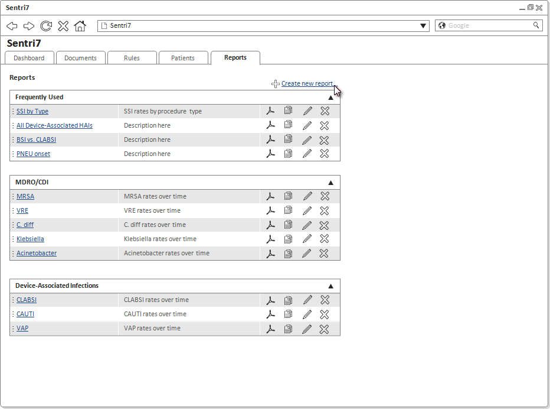

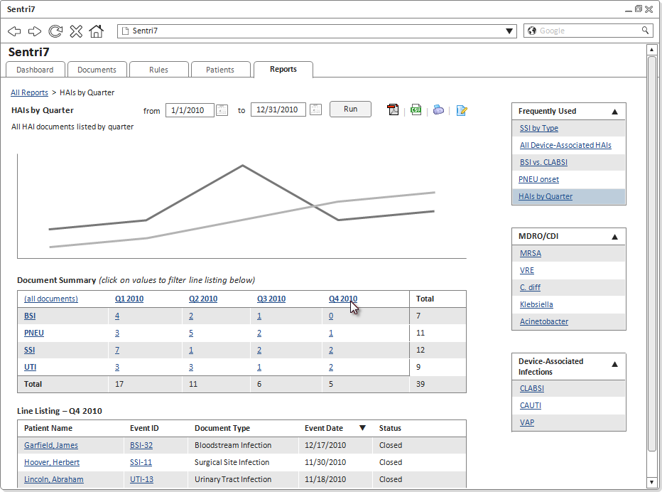

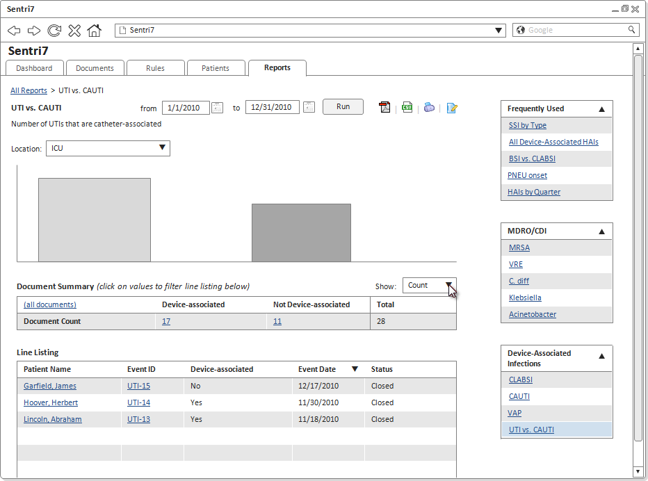

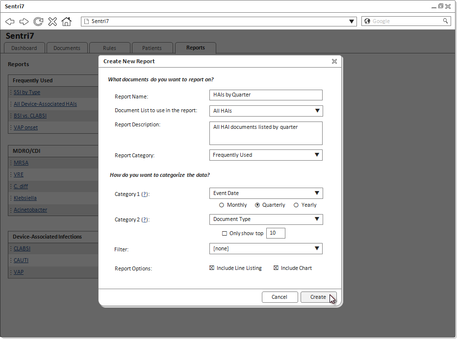

## Positive Cultures List Enhancements

I worked steadily over the course of over 8 months to improve the usability of this very powerful and useful grid through a series of incremental designs.

I made it fit better on smaller screens, allowed filtering out the data you didn’t want to see, and provided the ability to see more data at a glance without having to drill-down.

I also designed several key pieces of new functionality without adding unnecessary complexity.

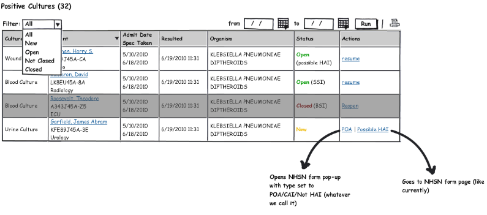

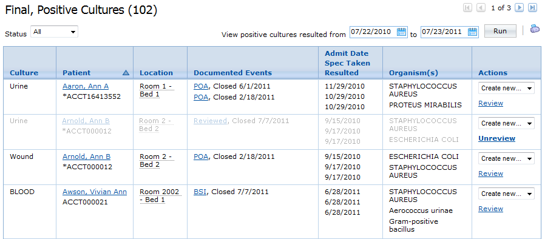

## NHSN Export Capability

I designed a set of UI screens for exporting documents to a government website that was quick and easy, yet provided some safeguards to prevent uploading documents that were incomplete or invalid.

I optimized the workflow for efficiency and clarity, continually providing feedback to the user along the way, and leveraged existing design patterns for consistency.

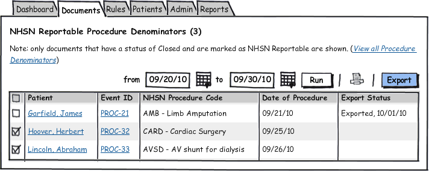

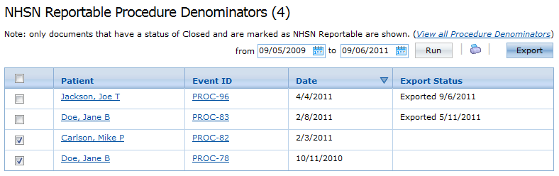

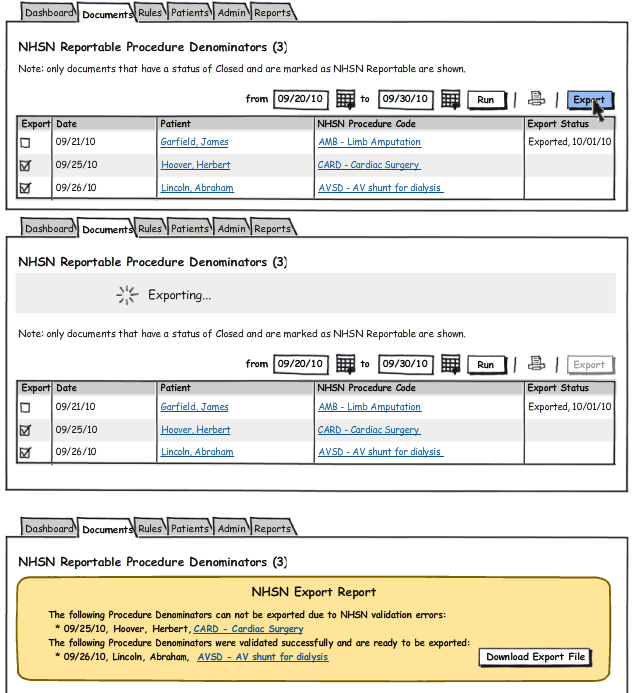

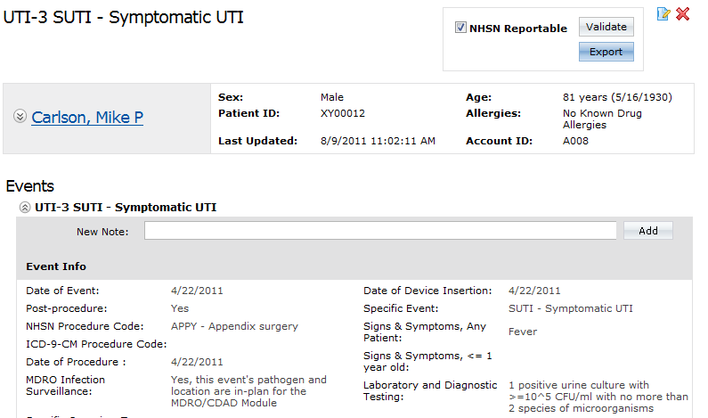

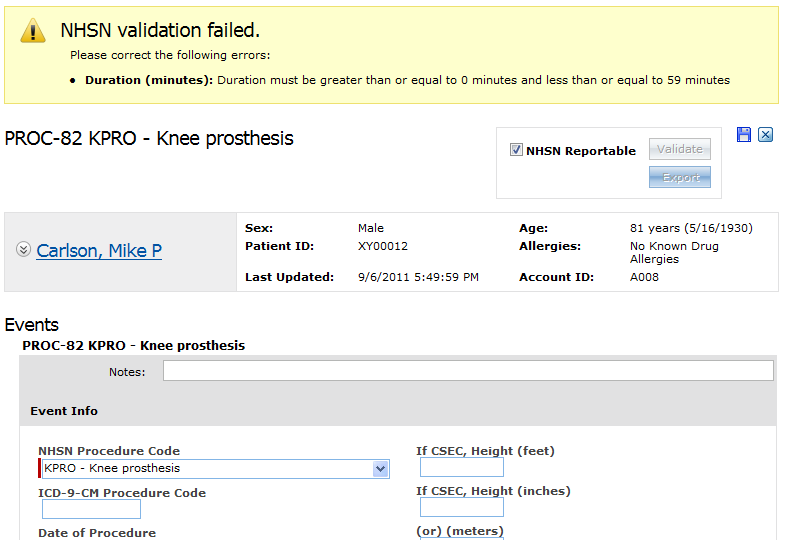

